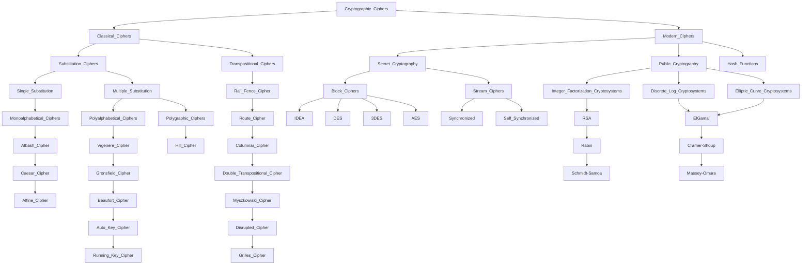

# cybersecurity notes

```mermaid
graph TD;
      Cryptographic_Ciphers --> Classical_Ciphers;
      Cryptographic_Ciphers --> Modern_Ciphers;
      Classical_Ciphers --> Substitution_Ciphers;
      Classical_Ciphers --> Transpositional_Ciphers;
      Modern_Ciphers --> Secret_Cryptography;
      Modern_Ciphers --> Public_Cryptography;
      Modern_Ciphers --> Hash_Functions;
      Substitution_Ciphers --> Single_Substitution;
      Substitution_Ciphers --> Multiple_Substitution;
      Transpositional_Ciphers --> Rail_Fence_Cipher;
      Secret_Cryptography --> Block_Ciphers;
      Secret_Cryptography --> Stream_Ciphers;
      Public_Cryptography --> Integer_Factorization_Cryptosystems;
      Public_Cryptography --> Discrete_Log_Cryptosystems;
      Public_Cryptography --> Elliptic_Curve_Cryptosystems;
      Stream_Ciphers --> Synchronized;
      Stream_Ciphers --> Self_Synchronized;
      Single_Substitution --> Monoalphabetical_Ciphers;
      Monoalphabetical_Ciphers --> Atbash_Cipher;
      Atbash_Cipher --> Caesar_Cipher;
      Caesar_Cipher --> Affine_Cipher;
      Multiple_Substitution --> Polyalphabetical_Ciphers;
      Multiple_Substitution --> Polygraphic_Ciphers;
      Polyalphabetical_Ciphers --> Vigenere_Cipher;
      Vigenere_Cipher --> Gronsfield_Cipher;
      Gronsfield_Cipher --> Beaufort_Cipher;
      Beaufort_Cipher --> Auto_Key_Cipher;
      Auto_Key_Cipher --> Running_Key_Cipher;
      Polygraphic_Ciphers --> Hill_Cipher;
      Rail_Fence_Cipher --> Route_Cipher;
      Route_Cipher --> Columnar_Cipher;
      Columnar_Cipher --> Double_Transpositional_Cipher;
      Double_Transpositional_Cipher --> Myszkowiski_Cipher;
      Myszkowiski_Cipher --> Disrupted_Cipher;
      Disrupted_Cipher --> Grilles_Cipher;
      Block_Ciphers --> IDEA;
      Block_Ciphers --> DES;
      Block_Ciphers --> 3DES;
      Block_Ciphers --> AES;
      Integer_Factorization_Cryptosystems --> RSA;
      RSA --> Rabin;
      Rabin --> Schmidt-Samoa;
      Discrete_Log_Cryptosystems --> ElGamal;
      Elliptic_Curve_Cryptosystems --> ElGamal;
      ElGamal --> Cramer-Shoup;
      Cramer-Shoup --> Massey-Omura;
```

[https://nvlpubs.nist.gov/nistpubs/SpecialPublications/NIST.SP.800-78-5.pdf](https://nvlpubs.nist.gov/nistpubs/SpecialPublications/NIST.SP.800-78-5.pdf)
