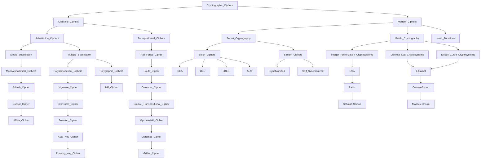

# cybersecurity notes

*Types of Malware*

- Spyware
- Adware
- Virus
- Worm
- Trojan Horse (Remote Access Trojan)
- Banking Trojans
- Muleware
- Doxxingware
- Cryptomalware (Ransomware)
- Grayware
- E-bomb
- Logic Bomb
- bot (botnet)
- Polymorphic malware
- Armored Malware
- Fileless Malware
- Potentially Unwanted Program (PUP)
- Keyloggers
- Backdoor
- Riskware
- Scareware
- Air-gapped malware
- Infostealers
- Rootkits
- Automated Threat
- Blended Threat
- Browser Hijacker
- Chargeware
- Code Injection (e.g. SQLI, XSS, LDAP)
- Crimeware
- Dialer
- Dropper
- File Binder
- Fleeceware
- Form Grabbing
- Malvertising
- Pharming
- Polymorphic code (uses a polymorphic engine)
- Pop-up Ad
- Rogue security software
- Targeted Threat
- Typhoid adware
- Virus hoax
- Webattacker
- Wiper Malware
- XARA
- Zip Bomb (a.k.a. Decompression Bomb or Zip of Death (ZOD))

*Attacks/Exploits*
- XARA
- Zero Day Vulnerability
- Side-Channel Attacks: power consumption, timing, or electromagnetic radiation
- Phishing/Smishing/Vishing/Quishing
- Password Attacks: Brute Force, Dictionary, Spraying, Rainbow Table, Credential Harvesting, Hybrid attack, Online Password attacks, Offline password attacks
- Privilege Escalation: Kernel Exploits, Weak or Reused Credentials, App/Service Misconfiguration, Vulnerable Third-Party Software, Container Breakouts, Sudo Setup Errors, Scheduled Tasks
- Meet-in-the-Middle (MitM)
- Man-in-the-Middle (MitM) a.k.a on-path attacks or interception attacks
- Replay Attack: Credential Replay, Credential Stuffing 
- RFID Cloning and Skimming
- Pivoting Attack (VM Escape in the context of virtual networks)
- DDoS Attacks: Amplified (e.g. Smurf attack) and Reflected attacks
- Forgery attacks: Cross-Site Request Forgery (CSRF) and Server-Side Request Forgery (SSRF)
- Wireless Attacks: Rogue access points, Evil twin, Deauthentication (disassociation) attacks, jamming attacks, MAC spoofing, device impersonation
- ARP Poisoning
- Session Replay: Cross-Site Scripting (XSS)

*Cryptographic Attacks*
Downgrade Attacks: SSL/TLS downgrade, SSL stripping
Collision Attack
Birthday Attack
Pass-the-Hash Attack

[https://nvlpubs.nist.gov/nistpubs/SpecialPublications/NIST.SP.800-78-5.pdf](https://nvlpubs.nist.gov/nistpubs/SpecialPublications/NIST.SP.800-78-5.pdf)
